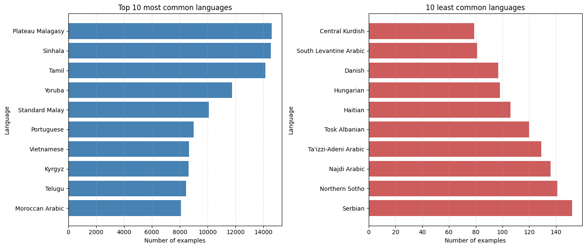
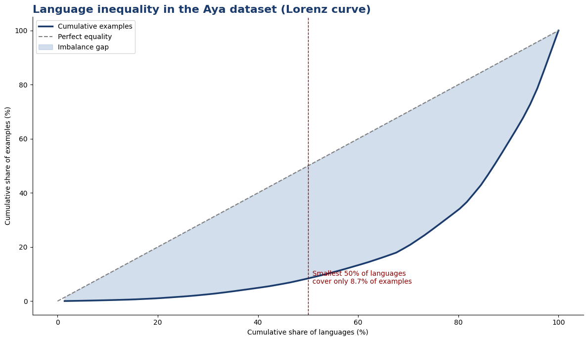
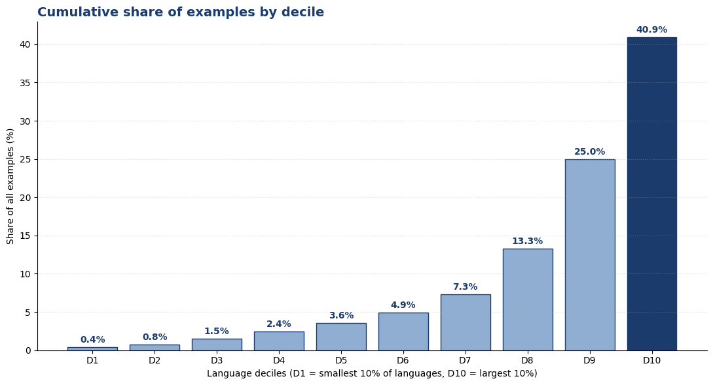
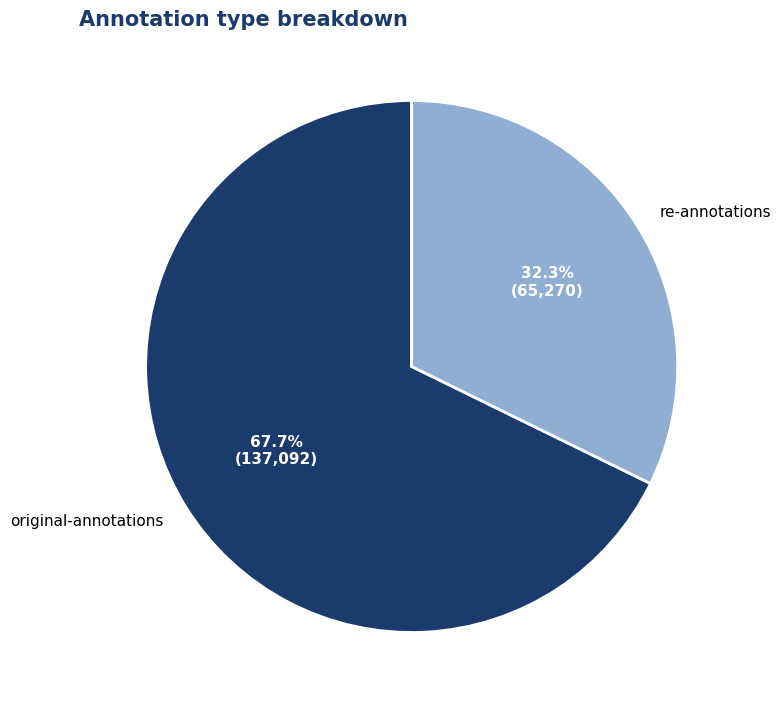
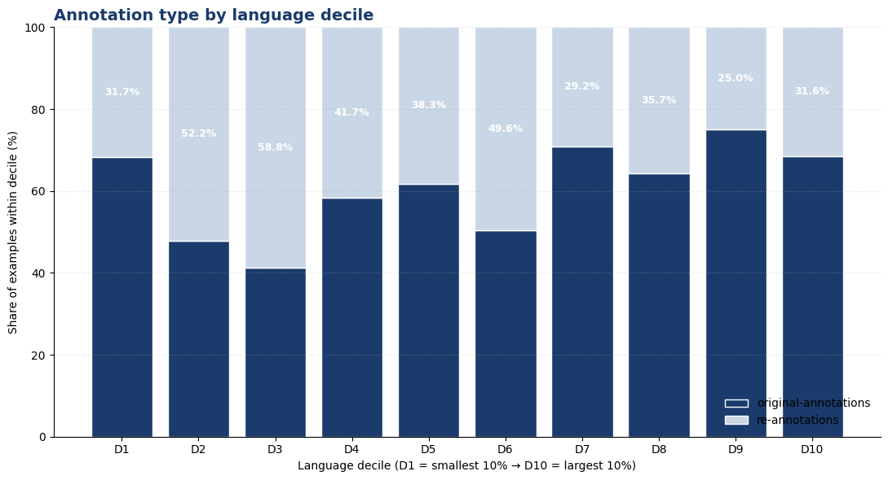
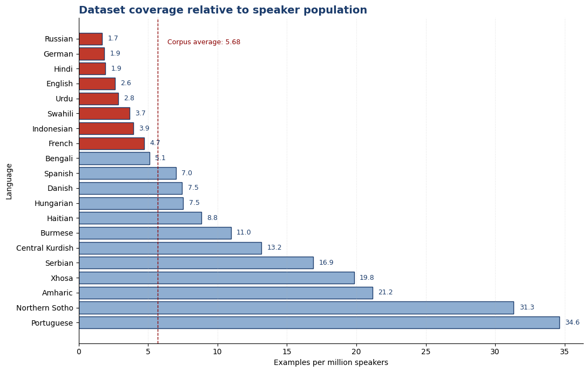
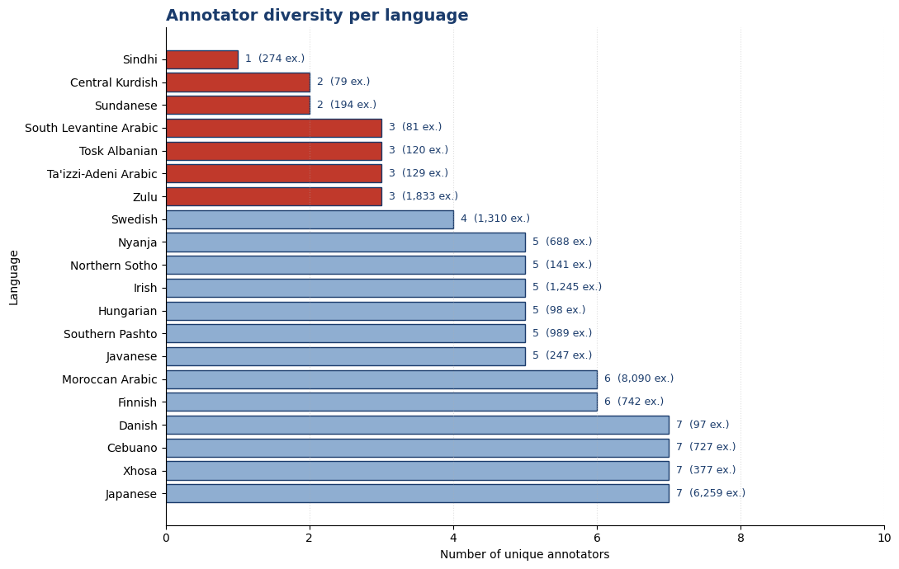
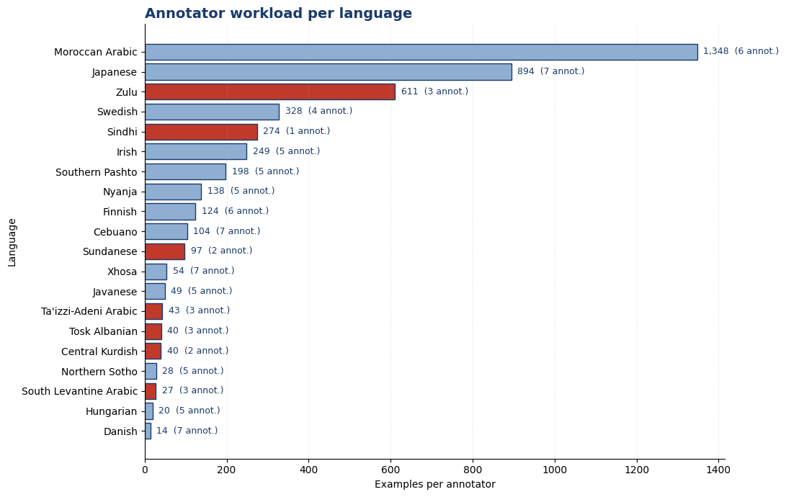

# Auditing the Aya Dataset: Does "71 Languages" Mean What You Think?

**Aya claims 71 languages. But does it actually represent them?**

This project audits the [Aya multilingual instruction dataset](https://huggingface.co/datasets/CohereForAI/aya_dataset) to find out how its data is really distributed. Beyond raw counts, this analysis measures coverage relative to speaker population, annotator diversity per language, re-annotation rates across size deciles, and tokenizer cost per language. The findings reveal three independent axes of imbalance — **example count**, **annotator concentration**, and **speaker-normalized coverage** — that a simple "languages supported" number completely hides.

- **Dataset:** Aya (202,362 rows, 71 languages)
- **Tools:** Python, pandas, matplotlib, NumPy
- **Scope:** distribution analysis, Lorenz-curve inequality measurement, annotation-type auditing, speaker-population normalization, annotator concentration analysis

---

## 1. Language Coverage Is Heavily Skewed

A first pass over `df["language"].value_counts()` across the dataset's 71 languages shows a steep imbalance: the top 10 languages hold 8k–14.5k examples each, while the bottom 10 hold only 80–150.

**Key takeaways:**
- **Heavily skewed distribution** — top languages (Plateau Malagasy, Sinhala, Tamil) each have well over 10,000 examples.
- **Long tail is real** — the 10 least-represented languages (Central Kurdish, South Levantine Arabic, Danish, and others) have only 80–150 examples each.
- **~100× head-to-tail ratio** — nearly two orders of magnitude separate the largest and smallest languages.
- **Evaluation risk** — small tail samples produce high-variance per-language metrics.
- **Training risk** — imbalanced data biases models toward high-resource languages.
- **Suggested action** — oversample tail languages, use stratified splits, and report metrics by language bucket rather than in aggregate.

---

## 2. Just How Unequal? A Lorenz Curve View

To quantify the imbalance beyond a simple ranked bar chart, examples were sorted from smallest to largest language and plotted as a Lorenz curve — the standard tool for measuring inequality (normally used for income distribution).

The smallest 50% of languages (by example count) cover only **8.7%** of all examples in the dataset. The further the blue curve bows away from the diagonal "perfect equality" line, the more concentrated the dataset is in a handful of languages.

Breaking this into deciles makes the concentration even clearer:

- The **largest 10% of languages (D10)** account for **40.9%** of all examples.
- The **smallest 50% of languages (D1–D5)** combined account for **under 9%**.
- This is a highly long-tailed distribution, though — as later sections show — not as catastrophic as raw counts alone suggest.

---

## 3. Original vs. Re-Annotated Data

Beyond per-language counts, each row in Aya is tagged with an `annotation_type`: either an original annotation or a re-annotation (a second pass over existing content).

Out of 202,362 total rows, **137,092 (67.7%)** are original annotations and **65,270 (32.3%)** are re-annotations.

**What this tells us:**

1. **The dataset is largely first-pass.** Rather than being a curated set of corrected or consensus-labelled examples, the bulk of the data represents a single annotator's original output. That's a reasonable design choice for a coverage-focused multilingual dataset — the priority is breadth of languages, not inter-annotator agreement — but it has consequences: quality variance across annotators and languages is largely unmeasured, and there's no built-in signal for which rows are "trustworthy."
2. **Re-annotation is rare and, where present, likely targeted.** Rows carrying the re-annotation label typically flag cases where a first annotation was considered insufficient, and are worth examining language by language.

**Implication for users:** treat annotation type as a *weak* quality label. Re-annotated rows can be considered higher-confidence and useful for validation or evaluation, while original-only rows should be assumed to carry normal single-annotator noise.

### Does re-annotation concentrate in high-resource languages?

A natural hypothesis is that better-resourced languages get more quality-control passes. Splitting re-annotation rate by language decile tests this directly:

The hypothesis doesn't hold. **D1** (smallest 10% of languages) has a **31.7%** re-annotation rate, and **D10** (largest 10%) has **31.6%** — a near-identical rate. The distribution is actually U-shaped / mildly inverted, peaking in the middle deciles (D3 at 58.8%, D6 at 49.6%) and dipping in the upper-middle (D9 at 25.0%).

This suggests re-annotation isn't a resource-driven process tied to language coverage, but rather a property of specific annotation campaigns or language-specific review initiatives:

- **Verification quality is roughly uniform across the head and tail** — low-resource languages are not systematically under-verified, which is a genuinely positive finding for dataset fairness.
- **Re-annotation is decile-localized, not global** — a handful of languages in certain deciles dominate the re-annotated set, worth investigating per-language rather than per-decile.

---

## 4. Normalizing by Speaker Population

Raw example counts only tell part of the story — they say nothing about whether a language's representation in Aya is proportionate to how many people actually speak it. Cross-referencing per-language example counts against approximate native (L1+L2) speaker populations for 20 languages reveals a very different picture.

**Findings:**

1. **Coverage does not track speaker population.** If Aya were representative, examples would scale with number of speakers. Instead, examples-per-million-speakers ranges from **1.69 (Russian)** to **34.6 (Portuguese)** — a ~20× spread across just these 20 languages, with no monotonic relationship to population size. Russian, German, and Hindi are the most under-served relative to their speaker base; Portuguese, Northern Sotho, Amharic, and Xhosa are the best-served.
2. **The largest languages are among the most under-represented relative to population.** Russian (2.5×10⁸ speakers) has only 423 examples; German (1.3×10⁸) has 241; Hindi (6×10⁸) has 1,153. All three sit at the bottom of the examples-per-million ranking. This is partly because large languages already have abundant NLP resources elsewhere, so Aya prioritizes other languages — but it means Aya is not a substitute for large monolingual corpora for these languages.
3. **Mid-population, high-annotation languages dominate the top of the ranking.** Portuguese, Amharic, Xhosa, Northern Sotho, and Serbian have relatively few speakers but a disproportionately high number of examples — strongly suggesting that coverage is driven by annotation-project availability, not linguistic demand.

---

## 5. Annotator Concentration: A Hidden Axis of Imbalance

Example count isn't the only thing that matters — *who produced the data* matters too. Grouping by `user_id` per language surfaces how many unique annotators contributed to each language and how much workload fell on each of them.

Some standout cases:

- **Sindhi** — all 274 examples come from a **single annotator**.
- **Central Kurdish** and **Sundanese** — only **2 annotators** each.
- **Zulu** — just **3 annotators** produced 1,833 examples (611 examples/annotator).
- **Swedish** — **4 annotators** for 1,310 examples.
- Even the largest languages in this subset (**Japanese**, **Moroccan Arabic**) sit under **10 annotators** each, despite having thousands of examples.

Annotator diversity is low and uneven across the board. This means dataset imbalance isn't only about *how many* examples a language has — it's also about *how many people* produced them, and heavy reliance on 1–3 annotators introduces idiosyncratic style, dialect, and error patterns that raw example counts don't capture. This is a previously hidden axis of imbalance that a "languages supported" number completely obscures.

---

## Summary: What We Found

This project set out to answer a simple question: **is the Aya dataset as multilingual as its name suggests, or is its language coverage uneven in ways that matter for training and evaluation?** Across five analysis passes — distribution, inequality measurement, annotation type, speaker-normalized coverage, and annotator concentration — the answer is consistent and specific: **the dataset is broad, but not balanced**, and the imbalance has multiple independent axes that a single "number of examples per language" metric fails to capture.

1. **The dataset is long-tailed, but not as extreme as raw counts suggest.** The largest 10% of languages contribute roughly 41% of all examples, while the smallest 50% contribute under 9% — a ~100× head-to-tail ratio on raw counts. Once normalized by speaker population, the spread narrows to roughly 20×, indicating that Aya's imbalance is real but not catastrophic. The dataset is uneven, not degenerate.

2. **Language coverage does not track speaker population.** Examples per million speakers range from ~1.7 (Russian) to ~34.6 (Portuguese). Large languages such as Russian, German, and Hindi sit near the bottom of that ranking despite having hundreds of millions of speakers. Inclusion in Aya is driven by annotation-project availability, not linguistic demand — a defensible design choice, but one that should be documented for anyone using the dataset as a proxy for global language coverage.

3. **Annotation quality is uniform across deciles — a genuinely positive result.** Re-annotation rates hover around 30% across every decile, including the smallest and largest. Low-resource languages are not systematically under-verified. This is a fairness-positive finding that sets Aya apart from many multilingual corpora, where quality control tends to concentrate in high-resource languages.

4. **Annotator concentration is a hidden, independent risk factor.** Several languages — Sindhi, Central Kurdish, Sundanese, Zulu, Swedish — depend on a handful of annotators, meaning single-person style and error patterns can dominate an entire language's representation regardless of example count.

**Bottom line:** a "languages supported" count is a poor proxy for how usable or fair a multilingual dataset actually is. Example count, speaker-population normalization, annotation-quality signals, and annotator diversity are independent axes that all need to be checked separately — and for Aya, they tell three different stories.

---

## Repo Contents

- `languagedatasetipynb.ipynb` — full analysis notebook (pandas/matplotlib)
- `images/` — exported charts used in this write-up

*Feel free to reach out or open an issue with questions about the methodology.*
